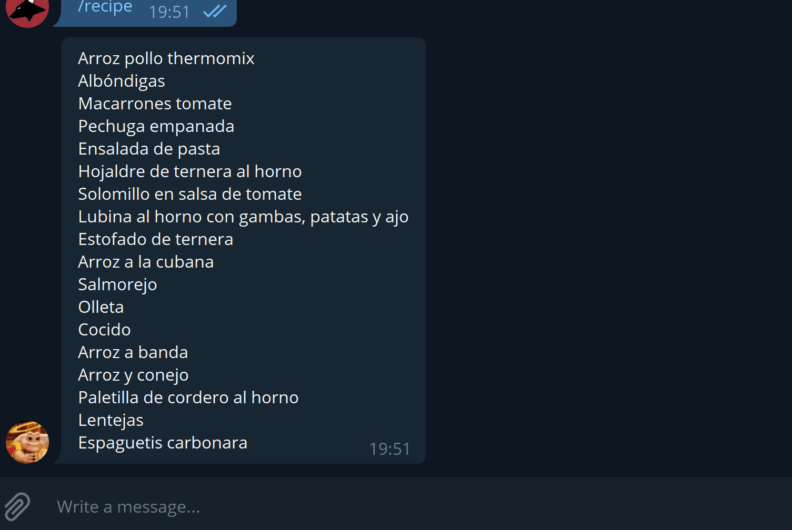

# Bot Telegram

Este es un proyecto python con el código para interactuar con un bot de recetas de telegram.

## Comandos disponibles

Los comandos disponibles de momento son:

* recipe - Gestión de recetas y menús semanales
* start - Da un mensaje de bienvenida

## Configuración

Es necesaria la creación de un fichero **.env** con los siguientes datos:

```
TELEGRAM_TOKEN=YOUR_TELEGRAM_TOKEN
TELEGRAM_GROUP_ID=YOUR_TELEGRAM_GROUP_ID
```

### Aclaración

Descripción de parámetros de configuración que se sobreescribirá en el fichero **.env**:

- TELEGRAM_TOKEN --> Token del bot telegram
- TELEGRAM_GROUP_ID --> Token del chat/grupo al que quieres mandar mensajes.

Los siguientes parámetros son opcionales, si no son especificados se utilizarán los valores por defecto especificados en el dichero  **docker-compose.yml**:

- POSTGRES_HOST --> Servidor de base de datos (host)
- POSTGRES_USER --> Usuario de la base de datos
- POSTGRES_PASSWORD --> Password de la base de datos
- POSTGRES_DATABASE --> Nombre de la base de datos

## Servidor PosrgreSQL con Docker

El servidor Postgre también está dockerizado

### Scripts creación de tablas

Tabla **menu_recipe**:

```
create table if not exists menu_recipe
(
    id        serial                not null
        constraint menu_recipe_pk
            primary key,
    is_lunch  boolean default false not null,
    is_dinner boolean default false not null,
    for_adult boolean default false not null,
    for_kids  boolean default false not null,
    name      text
);
```

# ¿Cómo montar el entorno?

Ir a la raíz del proyecto, una vez creado el **.env** y ejecutar el comando:


```
$ docker-compose up
```

Para resetear el entorno:

```
$ docker-compose down -v
```

A la base de datos podremos conectarnos usando el pgadmin abriendo en nuestro navegador la url localhost:6001, los datos  por defecto son:
EMAIL:postgres@postgres.com
PASSWORD:postgres

Una vez conectados al pgadmin, los datos para conectarnos con la BD son:
HOST: postgresql
USER: recipesbot
PASSWORD: recipesbot
PORT:5432

# Funcionamiento

Describimos alguna de las funcionalidades del bot.

## Recetas

La idea de la parte de recetas es que sea capaz de:

- Listar todas las recetas
- Dar una receta aleatoria
- Proponer un menú semanal para adultos y niños sin que se repitan las recetas

Así es como está ahora mismo:

